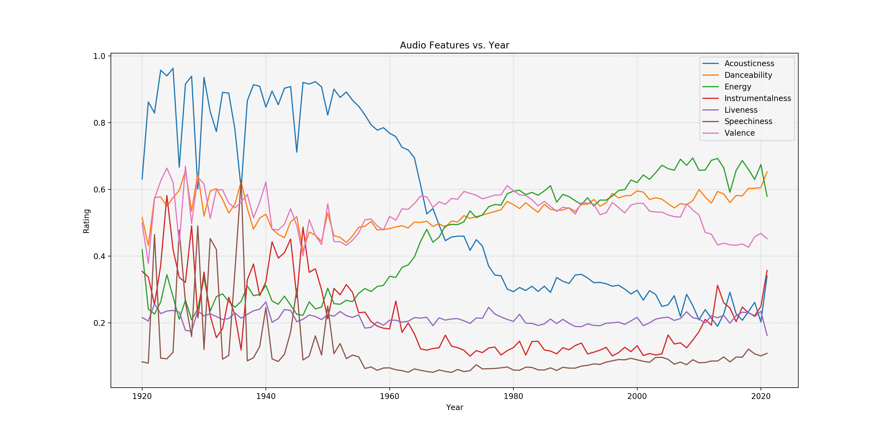

# Spotify Music Analysis - Trends, Comparison, and Correlations :musical_note:

The story of sound recording, and reproduction, began in 1877, when the man of a thousand patents, Thomas Edison, invented the phonograph. The commercialized music industry has only been around for about 100 years as the recording and radio technology emerged in the early 90s...

## Background

This was the first data analysis project in the Penn Data Boot Camp curriculum. As a team, we wanted to do something fun, exciting, and insightful while satisfying the baseline requirements. We searched through the web's databases, brainstormed ideas across various topics and landed on a dataset from Kaggle, the ["Spotify Dataset 1921-2020 Tracks"](https://www.kaggle.com/yamaerenay/spotify-dataset-19212020-160k-tracks?select=data_by_year.csv) dataset.

The data contained 170k+ songs collected by the Kaggle dataset creator (Yamac Eren Ay) from Spotify's Web API. Each row was a unique song track with its song facts (authors, release date, etc.), numerical audio feature ratings (acousticness, danceability, loudness, etc.), and Spotify-specific user ratings (popularity). The creator did a good job cleaning and organizing the datasets so the team had minimal necessary data cleaning to perform. Below is a snapshot of the data content:

<strong>Primary:</strong>
<ul>
  <li>id (Id of track generated by Spotify)</li>
</ul>
<strong>Numerical:</strong>
<ul>
  <li>acousticness (Ranges from 0 to 1)</li>
  <li>danceability (Ranges from 0 to 1)</li>
  <li>energy (Ranges from 0 to 1)</li>
  <li>duration_ms (Integer typically ranging from 200k to 300k)</li>
  <li>instrumentalness (Ranges from 0 to 1)</li>
  <li>valence (Ranges from 0 to 1)</li>
  <li>popularity (Ranges from 0 to 100)</li>
  <li>tempo (Float typically ranging from 50 to 150)</li>
  <li>liveness (Ranges from 0 to 1)</li>
  <li>loudness (Float typically ranging from -60 to 0)</li>
  <li>speechiness (Ranges from 0 to 1)</li>
  <li>year (Ranges from 1921 to 2020)</li>
</ul>
<strong>Dummy:</strong>
<ul>
  <li>mode (0 = Minor, 1 = Major)</li>
  <li>explicit (0 = No explicit content, 1 = Explicit content)</li>
</ul>
<strong>Categorical:</strong>
<ul>
  <li>key (All keys on octave encoded as values ranging from 0 to 11, starting on C as 0, C# as 1 and so on…)</li>
  <li>artists (List of artists mentioned)</li>
  <li>release_date (Date of release mostly in yyyy-mm-dd format, however precision of date may vary)</li>
  <li>name (Name of the song)</li>
</ul>

## Objective

<strong>In this project, our objective was to <em>uncover music trends</em>. In other words, the goal was to understand how artists, genres, the audio features develop over time and how the popularity of songs were perceived through the lens of Spotify and the perspective of its users.</strong>

We did this by using a series of models and approaches including:
<ol>
  <li>Time Series Analysis</li>
  <li>Summary Statistics</li>
  <li>Aggregation</li>
  <li>Radar Charts</li>
  <li>Correlation Analysis</li>
</ol>

## Analysis & Interpretations

Below are some highlights of the questions we asked and the results we produced. If you are interested to dig into more, here are the:

* [Full-Length Project Report](summary&presentation/Project_Analysis_Summary.docx)
* [Project Presentation Deck](summary&presentation/Spotify_Music_Exploration.pptx)

### How has the characteristics of music changed over time?

The taste to music and the way artists make music have certainly changed dramatically over the years! To pick a few to highlight: Acousticness (a higher rating of acousticness indicates a piece of music that primarily uses instruments that produce sound through acoustic means, as opposed to electronic means) dropped significantly from the early 1900s to today. Energy rating, on the other hand, increased over the years. Features like Danceability and Valence (positivity) stayed consistent over eras. Looking at these terends, one can interpret that today's music is very different from music 50, 100 years ago. While some features change, some others generally stay consistent potentially because the definition of music limits certain features to be within a range.

We also believe that the technologies like radio has enabled music to penetrate to virtually everyone in the world thus evolved the music industry with growing categories and innovation. In addition, the birth of the digital era also gives artists tools to make completely different music and explore the unfamiliar territory.

### From which era are the songs most popular for contemporary listeners?

The plot on the right is the average popularity scores for all songs in the dataset over the years. There is a clear trend that the average popularity increases as the years approach contemporary times. The average popularity peeked in around 2000 and started to decline. **Conclusion:** Songs from the late 1990s to the early 2000s are the most popular on Spotify.

*Additional comments/theories:*
1. Spotify's user base is basically dominated by Millennials, "with 29% of its users aged 25-34 and 26% aged 18-24 years old.” (Source: Statista). It’s no surprise that as the years go by, popularity grows since the Millennials are probably listening and catching up to contemporary songs. However, songs from 1960s to 1990s have popularities above average which shows us that the songs from that era are still extremely relevant. They are simply too good to be forgotted already and people are nostalgic enough to keep playing the songs that bring back the best memory to them.
2. As to why there’s a downward trend after 2000: one possible explanation is that songs are just like arts, they take time to be appreciated, recognized and people take time to catch up. However, one can't deny the possibility that today's music just doesn't resonate with the majority of Spotify listeners as much as the older ones.

### Who are the most timeless artists?

We thought it'd be fun to understand how artists’ careers flourish and decline, and we wanted to see which artists had an enduring career and maybe a lasting impact to the fans.

Through a series of data cleaning and aggregation/grouping, we selected two most relevant candidates for our analysis - Johnny Cash and Frank Sinatra. Though the "time spans of songs" represent the times when their songs are released but not necessarily the number of years when they're active, and that our analysis is confined with a limited dataset, we can still see these two artists are the "outliers" compared with other "old timers" when it comes to "longevity".

The plot shows the song popularity scores of the top 5 "old timers" over the years compared with the dataset average. We can see Johnny and Frank's popularities be above the average consistently throughout the mid 1900s and the early 2000s.

This is an additional plot of the number of songs released by year per each "old timer" to help us understand their career trajectories. Obviously their active years were in 1960s-1970s, but Jonny and Frank's popularity scores are still way higher than the average going into the 2000s (after they had died!)

**Conclusion:** Time is the greatest testament of someone’s greatness. With the confined assumptions of our analysis: looking at the U.S. music industry and through the lens of the Spotify's user base, we objectively conclude that Johnny Cash and Frank Sinatra are the two most timeless artists. Put it another way: Music’s legends continue to be popular till today.

### How do popular genres compare with each other?

......
......
