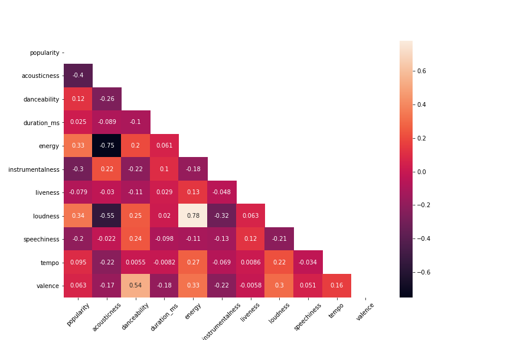

# Spotify Music Analysis - Trends, Comparison, and Correlations :musical_note: (UPenn Data Boot Camp)

The story of sound recording, and reproduction, began in 1877, when the man of a thousand patents, Thomas Edison, invented the phonograph. The commercialized music industry has only been around for about 100 years as the recording and radio technology emerged in the early 90s...

## Background

This was the first data analysis project in the Penn Data Boot Camp curriculum. As a team, we wanted to do something fun, exciting, and insightful while going above and beyond the baseline requirements. We searched through the web's databases, brainstormed ideas across various topics and landed on a dataset from Kaggle, the ["Spotify Dataset 1921-2020 Tracks"](https://www.kaggle.com/yamaerenay/spotify-dataset-19212020-160k-tracks?select=data_by_year.csv) dataset.

The data contained 170k+ songs collected by the Kaggle dataset creator (Yamac Eren Ay) from Spotify's Web API. Each row was a unique song track with its song facts (authors, release date, etc.), numerical audio feature ratings (acousticness, danceability, loudness, etc.), and Spotify-specific user ratings (popularity). The creator did a good job cleaning and organizing the datasets so the team had minimal necessary data cleaning to perform. Below is a snapshot of the data content:

<strong>Primary:</strong>
<ul>
  <li>id (Id of track generated by Spotify)</li>
</ul>
<strong>Numerical:</strong>
<ul>
  <li>acousticness (Ranges from 0 to 1)</li>
  <li>danceability (Ranges from 0 to 1)</li>
  <li>energy (Ranges from 0 to 1)</li>
  <li>duration_ms (Integer typically ranging from 200k to 300k)</li>
  <li>instrumentalness (Ranges from 0 to 1)</li>
  <li>valence (Ranges from 0 to 1)</li>
  <li>popularity (Ranges from 0 to 100)</li>
  <li>tempo (Float typically ranging from 50 to 150)</li>
  <li>liveness (Ranges from 0 to 1)</li>
  <li>loudness (Float typically ranging from -60 to 0)</li>
  <li>speechiness (Ranges from 0 to 1)</li>
  <li>year (Ranges from 1921 to 2020)</li>
</ul>
<strong>Dummy:</strong>
<ul>
  <li>mode (0 = Minor, 1 = Major)</li>
  <li>explicit (0 = No explicit content, 1 = Explicit content)</li>
</ul>
<strong>Categorical:</strong>
<ul>
  <li>key (All keys on octave encoded as values ranging from 0 to 11, starting on C as 0, C# as 1 and so on…)</li>
  <li>artists (List of artists mentioned)</li>
  <li>release_date (Date of release mostly in yyyy-mm-dd format, however precision of date may vary)</li>
  <li>name (Name of the song)</li>
</ul>

## Objective

<strong>In this project, our objective was to <em>uncover music trends</em>. In other words, the goal was to understand how artists, genres, the audio features develop over time and how the popularity of songs were perceived through the lens of Spotify and the perspective of its users.</strong>

We did this by using a series of models and approaches including:
<ol>
  <li>Time Series Analysis</li>
  <li>Summary Statistics</li>
  <li>Aggregation</li>
  <li>Radar Charts</li>
  <li>Correlation Analysis</li>
</ol>

## Analysis & Interpretations

Below are some highlights of the questions we asked and the results we produced. If you are interested to dig into more, here are the:

* [Full-Length Project Report](summary&presentation/Project_Analysis_Summary.docx)
* [Project Presentation Deck](https://docs.google.com/presentation/d/170KSaskGR-eWSp_uSo_Qr0fKcEIBNPetV1cH-hzRpK0/edit?usp=sharing)

### How have the characteristics of music changed over time?

The taste to music and the way artists make music have certainly changed dramatically over the years! To pick a few to highlight: Acousticness (a higher rating of acousticness indicates a piece of music that primarily uses instruments that produce sound through acoustic means, as opposed to electronic means) dropped significantly from the early 1900s to today. Energy rating, on the other hand, increased over the years. Features like Danceability and Valence (positivity) stayed consistent over eras. Looking at these terends, one can interpret that today's music is very different from music from 50-100 years ago. While some features change, some others generally stay consistent potentially because the definition of music limits certain features to be within a range.

We also believe that the technologies like radio have enabled music to penetrate to virtually everyone in the world thus evolved the music industry with growing categories and innovation. In addition, the birth of the digital era also gives artists tools to make completely different music and explore the unfamiliar territory.

### From which era are the songs most popular for contemporary listeners?

The plot on the right is the average popularity scores for all songs in the dataset over the years. There is a clear trend that the average popularity increases as the years approach contemporary times. The average popularity peeked in around 2000 and started to decline. **Conclusion:** Songs from the late 1990s to the early 2000s are the most popular on Spotify.

*Additional comments/theories:*
1. Spotify's user base is basically dominated by Millennials, "with 29% of its users aged 25-34 and 26% aged 18-24 years old.” (Source: Statista). It’s no surprise that as the years go by, popularity grows since the Millennials are probably listening and catching up to contemporary songs. However, songs from 1960s to 1990s have popularities above average which shows us that the songs from that era are still extremely relevant. They are simply too good to be forgotted already and people are nostalgic enough to keep playing the songs that bring back the best memory to them.
2. As to why there’s a downward trend after 2000: one possible explanation is that songs are just like arts, they take time to be appreciated, recognized and people take time to catch up. However, one can't deny the possibility that today's music just doesn't resonate with the majority of Spotify listeners as much as the older ones.

### Who are the most timeless artists?

We thought it'd be fun to understand how artists’ careers flourish and decline, and we wanted to see which artists had an enduring career and maybe a lasting impact to the fans.

Through a series of data cleaning and aggregation/grouping, we selected two most relevant candidates for our analysis - Johnny Cash and Frank Sinatra. Though the "time spans of songs" represent the times when their songs are released but not necessarily the number of years when they're active, and that our analysis is confined with a limited dataset, we can still see these two artists are the "outliers" compared with other "old timers" when it comes to "longevity".

The plot shows the song popularity scores of the top 5 "old timers" over the years compared with the dataset average. We can see Johnny and Frank's popularities be above the average consistently throughout the mid 1900s and the early 2000s.

This is an additional plot of the number of songs released by year per each "old timer" to help us understand their career trajectories. Obviously their active years were in 1960s-1970s, but Jonny and Frank's popularity scores are still way higher than the average going into the 2000s (after they had died!)

**Conclusion:** Time is the greatest testament of someone’s greatness. With the confined assumptions of our analysis: looking at the U.S. music industry and through the lens of the Spotify's user base, we objectively conclude that Johnny Cash and Frank Sinatra are the two most timeless artists. Put it another way: Music’s legends continue to be popular till today.

### How do popular genres compare with each other?

With the comprehensive data in hand, we wanted to dive deeper into the music features and explore what makes a piece of music music. we decided to compare popular genres to see if it offers any insight as to how the contemporary music is produced and whether if there's any noticeable similarity or difference.

To do this, we subjectively chose five genres that we believed to be popular and acceptable by a large population. We then picked the artists that best represented the respective genres based on review of the 2021's Billboard 200. Histrograms of music features for each artist were created and inspected to ensure an appropriate statistical value as a representation of the music feature scores. Finally, the average scores for each artist were normalized to standardize different data domains and plotted on an overlaid radar chart for comparison.

**Observations:**
<ul>
  <li>All genres chosen have low speechiness and low instrumentalness. These are under expected as shown earlier in the music trends over years GIF.</li>
  <li>Acousticness scores for Taylor Swift and Explicit scores for Eminem differentiated from the other genres/artists as pertinent to the characteristics of dance and rap music respectively.</li>
  <li>While the difference between genres, features like tempo, valence, energy, danceability, and duration, etc. have overlapping average scores. With some common sense, one can interpret these as the "common grounds" of music or infer the contemporary audience are attracted to a particular level of each of these features. For example, "people generally like listenting to music that feeds off a positive vide, has high energy, and is danceable."</li>
</ul>

While it's fun to observe certain characteristics of different artists and genres, here we raise an open-ended question for further discovery to entertain those that are eager to keep exploring: _To what extent can music be "manufactured" or "engineered" to be liked by humans? Is there a limit to the variations of music, or rather asked more philosophically, is creativity reproduceable?_

### How do audio features correlate with each other AND How accurately can we predict popularity given audio features?

As we see from above that there are similarities and differences between genres, we wanted to explore if one feature impacts the other, and ultimately to have a deeper understanding of music, that if given enough data we can predict any song's popularity at a reasonable accuracy.

Below is a Pearson Correlation heatmap made with seaborn which shows the relationships among and between the music features and popularity. The darker the color (or the lower the score), the more negatively correlated the variables are. Vice versa, the ligher the color (or the higher the score), the more positively correlated the variables are.

**Noteworthy Correlations Between Features:**
<ul>
  <li>Valence vs. Danceability = 0.54 --> The more positive a song is, the more danceable it's likely to be.</li>
  <li>Loudness vs. Acousticness/Energy = -0.55/0.78 --> The louder a song is, the less acoustic and the more energetic it's likely to be.</li>
  <li>Energy vs. Acousticness = -0.75 --> The more energetic a song is, the less acoustic it's likely to be.</li>
</ul>

**Noteworthy Correlations Between Features and Popularity:**
<ul>
  <li>Popularity vs. Acousticness = -0.4 --> Acoustic music mostly indicates a piece of music that's solely or mostly comprised of the sounds of instruments, such as classical music or jazz. As those types of music are certainly less popular in today's market, acousticness score can potentially be a good predictor of popularity.</li>
  <li>Popularity vs. Energy = 0.33 --> Energy is also likely a strong contributing factor of if a piece of music can be popular.</li>
</ul>

Based on the above analysis, we found that there isn't one single variable that affects the popularity of a song in a major way. Due to time limitation of this project and the analytical techniques we mastered at the time of completion, we decided not to perform further analyses like regression or machine learning frameworks like clustering to determine the viability of predicting popularity based on music feature scores.

## Conclusions
1. Music features appear to have evolved over time and began stabilizing around 1960;
2. Major genres have similar music characteristics, but divergences are noted for some variables;
3. No single music features can effectively predict a song’s popularity; some covariance found amongst the music features;
4. Songs from the late 1990s to the early 2000s are the hottest on Spotify;
5. Music’s legends continue to be popular today.

